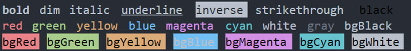

# The NodeJS Liri Bot
Welcome! The Node JS Liri Bot App is a NodeJS command line app that allows you to search for songs, movies, and upcoming concerts. The application includes additional features to enhance user experience

## Demo
[](https://github.com/renovatio4ever/renovatio4ever.github.io/tree/master/Liri-Node-App)

## Online Guide
Before you take a journey with me through the wonderful world of coding this Node JS app, why don't you visit the website for a brief tutorial.

[](https://renovatio4ever.github.io/Liri-Node-App/)

## Installation
To install and run Liri, type the following in your terminal:
```
git clone https://github.com/renovatio4ever/renovatio4ever.github.io.git Liri-Node-App
cd Liri-Node-App
npm init
npm install bandsintown
npm install node-spotifiy-api
npm install omdb
npm install axios
npm install chalk
npm install dotenv
npm install figlet
npm install fs
npm install moment
npm install node-cmd
touch .env
Add your spotify client and secret ID
node liri.js <subcommand> <option>
```
Make sure to register for spotify to obtain your CLIENT_ID, and SECRET_ID to add to the `.env` file! To see available subcommands, simply type `node liri.js help` or scroll down this page.

## NPM Package Usage Summary
- `npm init` First and required step! Initializes package.json.
- `bandsintown` Bands API
- `node-spotifiy-api` Spotify API. Requires registration and obtaining CLIENT_ID, and SECRET_ID.
- `omdb` OMDB Movie API. Requires registration and obtaining free limited client key.
- `axios` Process API requests.
- `chalk` Cosmetic. Applies colors to console text.
- `dotenv` Allows processing of keys required to process API requests.
- `figlet` Converts simple strings into wonder ASCII works of art.
- `fs` Allows solution to read and write to flat files stored on the computer (i.e. logs.txt)
- `moment` Used to acquire current time stamp and format date input. In this solution we are only using it to acquire the current time stamp.
- `node-cmd` Pretty clever npm used to process user or system commands.

## Usage
Available subcommands include:
- `node liri help` - brings up quick usage guide
- `node liri concert-this <artist name>` - searches for upcoming concerts for your specified artist.
- `node liri spotify-this-song <search query>` - searches Spotify for your query and returns the top song name, artist name, album name, and a 30 second MP3 preview.
- `node liri movie-this <movie name>` - searches for your specified movie and returns many details, such as the release year, ratings, and actors.
- `node liri do-what-it-says` - if a file called "random.txt" exists in your current working directory, Liri will execute any of its commands found in that file. Example contents of random.txt:
```
spotify-this-song, "five finger death punch"
```

## Log
A history of all output is saved in the file `log.txt`. To access the log file enter the command:
- `node liri log` - outputs log file

## Features
- [x] Written using: HTML5, CSS, NODEJS, JS, UIkit, and leverages NPM packages for user input processing
- [x] Uses the `npm chalk` package for text colors
- [x] Uses the `npm figlet` package for large ASCII header

## Coding Highlights
- This application features the `npm chalk` package which allows for customization of text colors. The following snippet demonstrates the application of colors for the output results of `node liri help` console output
```
 console.log(`
        ${chalk.inverse.cyan('How to use The Liri Bot')}
        ${chalk.green('Concerts')}: ${chalk.blue('node liri concert-this <concert/band name>')} 
        ${chalk.green('Spotify')}: ${chalk.blue('node liri spotify-this-song <desired song>')} 
        ${chalk.green('Movies')}: ${chalk.blue('node liri movie-this <movie title>')}
        ${chalk.green('Pre defined entry')}: ${chalk.blue('node liri do-what-it-says <no input>')}
                `)
```
[](https://www.npmjs.com/package/chalk)

- This application also features the `npm figlet` package which allows for application of fancy ASCII text from a simple input string. In this snippet the string `Cool Title` is passed to the npm with `ANSI Shadow` ASCII art type. The result is the depicted application title.
```
 console.clear();
    figlet.text('Node JS Liri Bot', {
        font: 'ANSI Shadow',
        horizontalLayout: 'default',
        verticalLayout: 'default'
    }, function (err, data) {
        if (err) {
            console.log('Something went wrong...');
            console.dir(err);
            return;
        }
```
[](https://www.npmjs.com/package/figlet)

## Road Map
- [ ] Add improved error handling for search queries that return a null or erroneous value
- [ ] Convert to list user inputs to limit potential user entry errors


