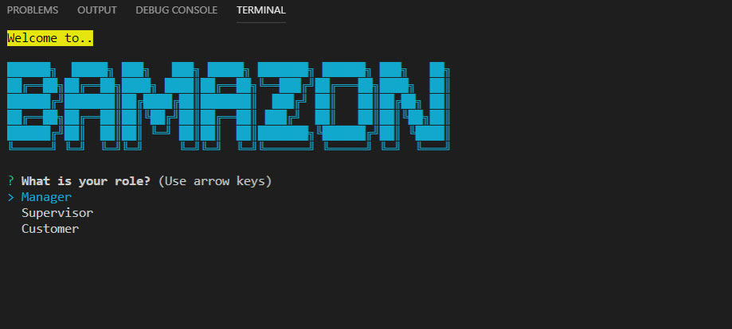
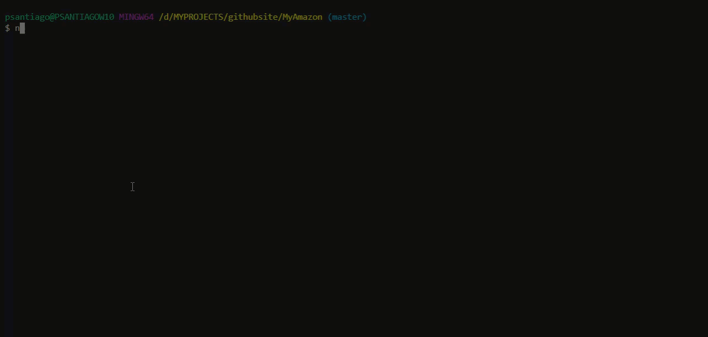

# BAMAZON

## **Description**
Amazon-like storefront application using Node.js and MySQL. It presents three interfaces: customer, manager and Supervisor.

## **Bamazon Demo**
You can  watch the demo of the Bamazon customer,manager, and supervisor interfaces at the link below. 

## **NPM Packages Used :**
mysql, inquirer, easy-table, dot-env, and colors npm packages

## **MySQL Database Setup**
To run this application, you need to setup MySQL database  on your machine. then you will need to create bamazon database and both products and departments table with the SQL code found in bamazon.sql. Run this code inside your MySQL client then you will be ready to proceed with running the bamazon customer, manager and suoervisor interfaces.

## **Getting Started**
to run this app you will need to :
* Clone repo.
* Run command in Terminal or Gitbash 'npm install'
* Run command depending which mode you would like to be on:
    * Customer - 'node  bamazonCustomer.js'
    * Manager - 'node bamazonManager.js'
    * Supervisor - 'node bamazonSuoervisor.js'

## **Features**
* Each module contains an exit option to exit each routine cleanly

## **Supervisor Console**
This is a demo of the Supervisor console. Supervisors can create departments, and view all sales relevant to that department

## **Manager Console**
This is a demo of the Manager console. Managers can view low inventory, add inventory, and add new products.

## **Customer Console**
This is a demo of the Customer console. Customers can purchase items by number of units.

## **MySQL Console**
This is a quick view of the actual mySQL table containing the contents of bamazon called by node JS.

